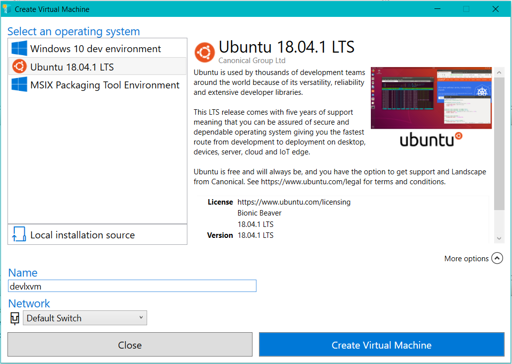
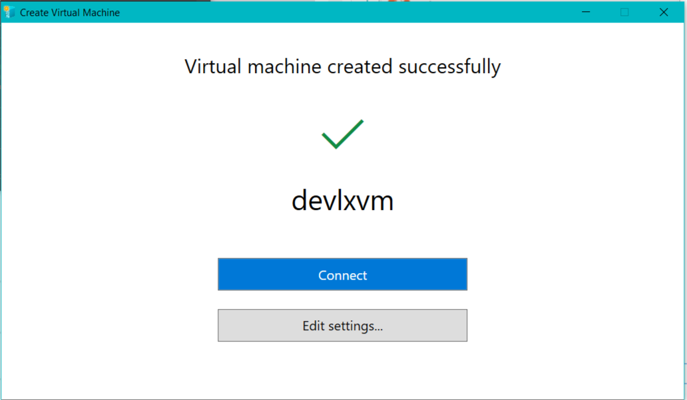
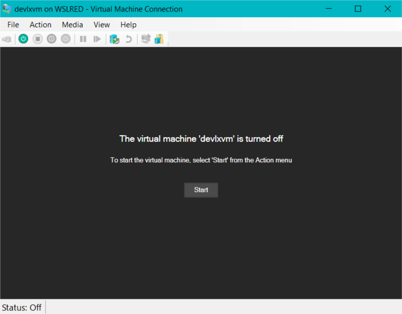
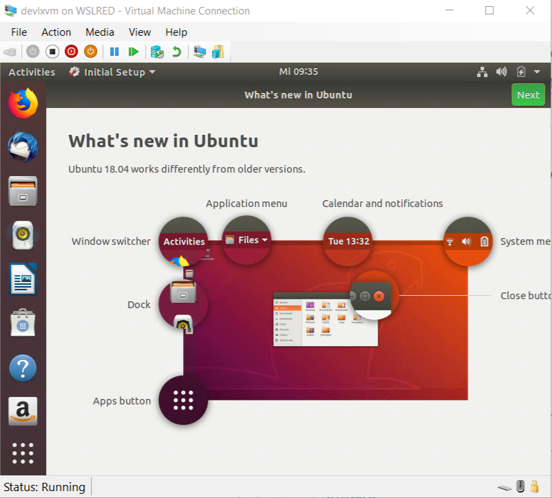
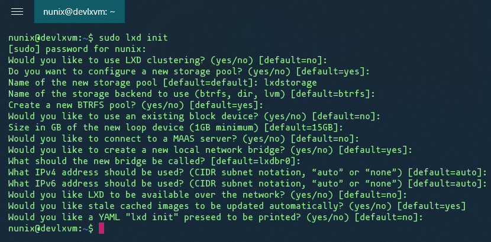
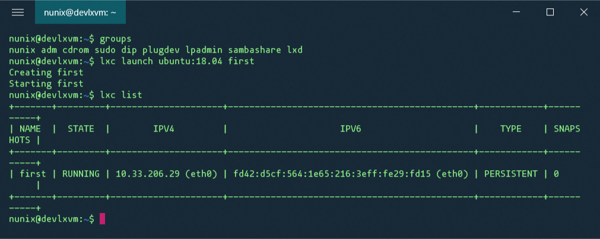
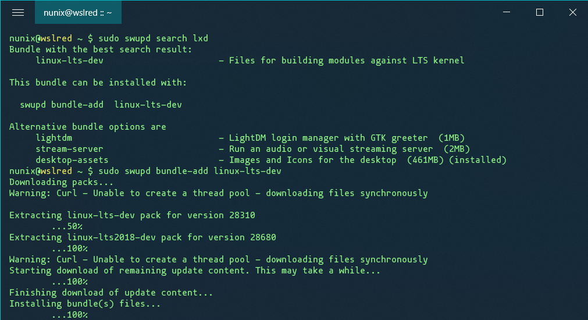
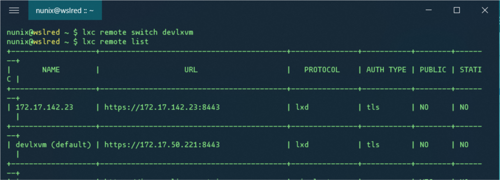

# Introduction

Once upon a time, the giants molded earth. They created tools for their intensive labor and in their kindness they shared it with the tiny humans that wanted to copy what the giants where doing.

And for the mightiest of the tiny humans, the giants allowed them to stand on their shoulders so they could be amazed by the view.

As a tiny human, I do say Thank You to these Giants.

## ⚠ Warning ⚠

This setup is highly experimental, so try it for "the fun of doing it". Even if it might be stable once everything is in place,  the different layers used might have an (big?) impact on the performances.

Now that you've been warned, let's start.

# The giants' tools

In order to craft this environment, the following tools will be needed:

* A [WSL distro](https://docs.microsoft.com/en-us/windows/wsl/install-win10) (duh)
* [Hyper-v with Ubuntu](https://blogs.windows.com/buildingapps/2018/09/17/run-ubuntu-virtual-machines-made-even-easier-with-hyper-v-quick-create/) from the quick create
* [LXD and LXC](https://linuxcontainers.org/lxd/getting-started-cli/)
* [DevLx](https://github.com/bketelsen/devlx)

As you might have guessed by now, the setup will be split in two parts: 

1. Ubuntu VM guest on Hyper-V where LXD will be running
2. WSL on machine host where LXC and DevLx will be launched

## Knowledge is power

This solution is (heavily) inspired by the knowledge shared by two Giants: [Brian Ketelsen](https://twitter.com/bketelsen) and [Stéphane Graber](https://twitter.com/stgraber)

You can read more about LXD remote from [Stéphane's blog](https://stgraber.org/2016/04/12/lxd-2-0-remote-hosts-and-container-migration-612/), and see [Brian's video](https://youtu.be/W6A00CHiDQ8) about DevLx (previously named LxDev)

And now that we do have the tools and knowledge, it's time to create something on our own.

# Server setup: Ubuntu and LXD goodiness

## Virtual Machine creation

The first action to do is, if not done already, to create a new Ubuntu VM with the quick create function:

* Open Hyper-v Management console


* Create a new Ubuntu VM from the Quick Create gallery






* \[OPTIONAL] Customize CPU and RAM by clicking "Edit settings..." in the final window


* Click "Connect" in the final window and click "Start" on the VM connection window



* Setup Ubuntu based on your preferences and you are now good to go



## Setup connection from WSL

As we will be mainly working from WSL, then a nice (and optional) action to do is to setup the SSH connectivity to the VM.

First we will need to install OpenSSH server on the VM:

```bash
### Update the system first
sudo apt update && sudo apt upgrade

### Install OpenSSH server
sudo apt install openssh-server

### Test the connection
ssh localhost
```

Now back to WSL, we will need to find a way to connect to the VM despite the fact of having a dynamic IP.

Hopefully for us, Microsoft has created a tool to communicate with Hyper-V VMs, I do present you `hvc.exe` (location: c:\Windows\System32)

There is two different ways to connect using `hvc.exe`:

1. Get the IP of the running VM: `hvc.exe ip -4 VM_NAME`
   * Actually, the full command will need to be `hvc.exe ip -4 VM_NAME | tr -d '\r'`
   * The `hvc.exe` command actually ends with a cariage return character which will cause an error if we would connect with ``ssh `hvc.exe ip -4 VM_NAME` ``
2. Connect directly to the VM using SSH: `hvc.exe ssh VM_NAME`

For this particular blog, the solution 2 will be the best and to make it easier, here is an alias that can be used: `alias sshvm="hvc.exe ssh"`

**\[OPTIONAL] Copy the SSH key**

In order to avoid entering the SSH password on each connection, we can copy the SSH key:

```
ssh-copy-id `hvc.exe ip -4 devlxvm | tr -d '\r'`
```

Bonus: the command `hvc.exe ssh` will also be impacted.

## Install LXD on server

Now that the connectivity is in place, we can install all the components.

We will start by installing LXD on the Ubuntu VM:

```
### Connect to the VM (I will do it without the alias)hvc.exe ssh VM_NAME### Install LXDsudo apt install lxd lxd-client
```


Once LXD installed, the storage for the containers needs to be configured:

```
### Keep all the defaults or change only the storage pool namelxd init
```



Now we can create our first container:

```
### Create the containerlxc launch ubuntu:18.04 first### Confirm that the container is createdlxc list
```



## Enable remote connection for LXD on server

Based on [Stéphane's blog](https://stgraber.org/2016/04/12/lxd-2-0-remote-hosts-and-container-migration-612/), in order to enable the remote connection to LXD, we need to run the following 2 commands:

```
### Set the port which LXD will listen tolxc config set core.https_address [::]:8443
### Set a password for authenticating the remote clientslxc config set core.trust_password something-secure
```

Our server is now fully configured, time to configure our WSL client.

## Install LXC on WSL

Due to the different distros available, please find the correct install method from this [blog](https://linuxcontainers.org/lxd/getting-started-cli/)

My (current) distro for dev is ClearLinux, and as it's not listed, here is the way to install LXC:

```
### Search which bundle contains LXDsudo swupd search LXD### Install the recommended bundlesudo swupd bundle-add linux-lts-dev
```



## Add the remote LXD server

We will add the remote LXD server and also will set it as default, so every "local" command will actually be run on the remote server:

```
### Add the remote LXD server -> This will request the password we set on the serverlxc remote add LXD_NAME `hvc.exe ip -4 VM_NAME | tr -d '\r'`
```


```
### Set the remote LXD server to be the defaultlxc remote switch LXD_NAME### Check the configlxc remote list
```



Finally, let's create a new container from WSL directly to the remote LXD server:

```
### Create new containerlxc launch ubuntu:18.04 first-remote### Check if the container has been created with the local and remote commandlxc listlxc list LXD_NAME:
```


As shown in the screenshot, the first `lxc list` does not show any IP, this is because the container was still being created.

# Conclusion

While this blog might be long to read (and was definitively long to write), the hands-on will take you about 10-15 minutes and it's more due to all the downloads needed.

As this blog states, there is still the DevLx piece missing, and I will add it as soon as possible. Until then, once this setup is done, you can continue from [Brian's github](https://github.com/bketelsen/devlx)

> _**\>>> Nunix out <<<**_
