# Introduction

What if Docker Desktop could help us run our containerized applications in the Cloud *just like that?*
A dream? well no more! Since the [Docker Desktop Edge 2.3.2](https://www.docker.com/blog/running-a-container-in-aci-with-docker-desktop-edge/), we can now add a context for the [Azure Container Instances (ACI)](https://docs.microsoft.com/en-us/azure/container-instances/).

In short, we can run containers **the exact same way** in the Cloud as if it were running locally.

And the best of it, thanks to the WSL integration, we can run everything from our preferred distro.
So let's jump into the action and reach for the Cloud.

# Sources

Before we start going through all the steps, please note that this blog post is **heavily** based on the excellent [blog post](https://www.docker.com/blog/running-a-container-in-aci-with-docker-desktop-edge/) by [Ben De ST Paer-Gotch](https://twitter.com/Nebuk89).

# Prerequisites

As usual, in order to ensure our setup will be "as near" as the one used, here is the list of prerequisites:

* OS: Windows 10 with the latest update (2004)
  		* For this setup, Windows 10 Insider on Dev channel v20175 is the one used
* WSL2: [a Store or Custom distro](https://wiki.ubuntu.com/WSL)
* Docker Desktop Edge v2.3.4.0
* \[Optional] Windows 10 application installer [`winget`](https://github.com/microsoft/winget-cli) v0.1.41821 Preview
* \[Optional] [Windows Terminal](https://github.com/microsoft/terminal)

Finally, as the goal is to run the containers in Azure Container Instances, an [Azure account](https://azure.microsoft.com/en-us/free/) will be needed.

# Installation: Winget it

Before we can start, we will need to install Docker Desktop Edge. And in order to do it *the easiest way possible*, Windows has now its own, Open Source, package manager: [Winget](https://github.com/microsoft/winget-cli).

Launch Powershell in a Terminal as Administrator and let's install Docker Desktop on Windows:

* Search for `docker` packages

```bash
winget search docker
```

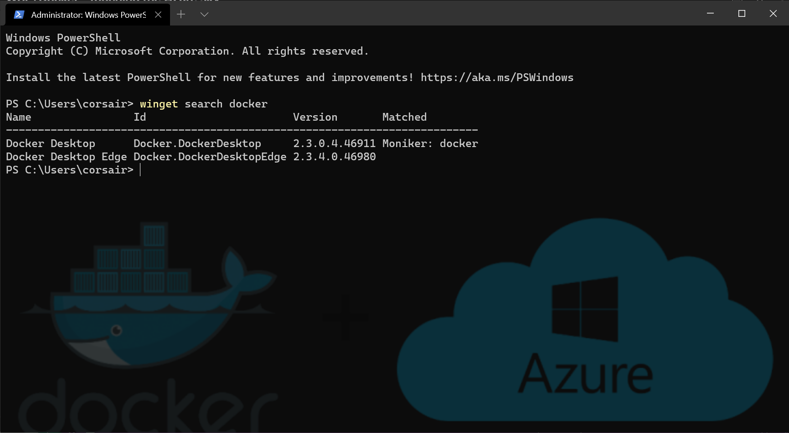

* Install Docker Desktop Edge

```bash
winget install Docker.DockerDesktopEdge
```

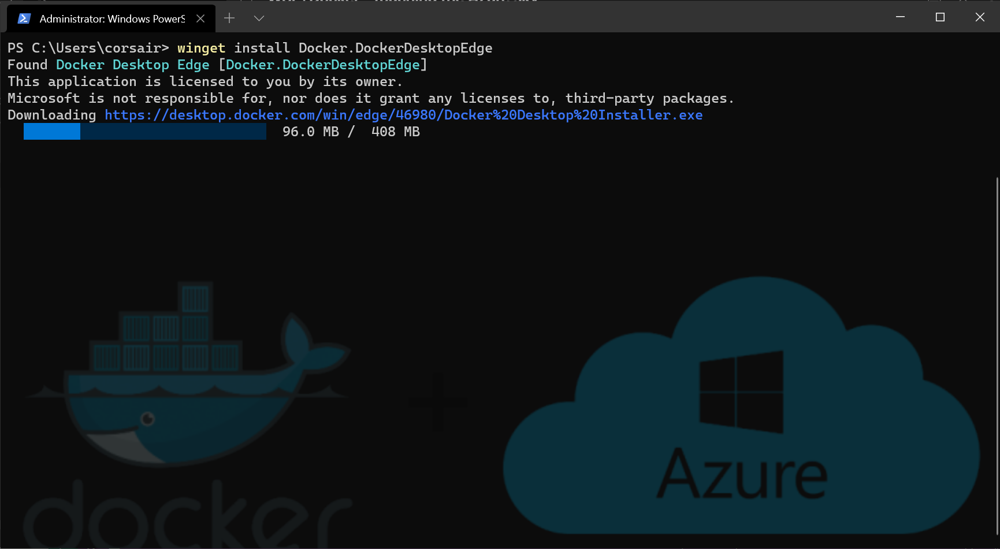

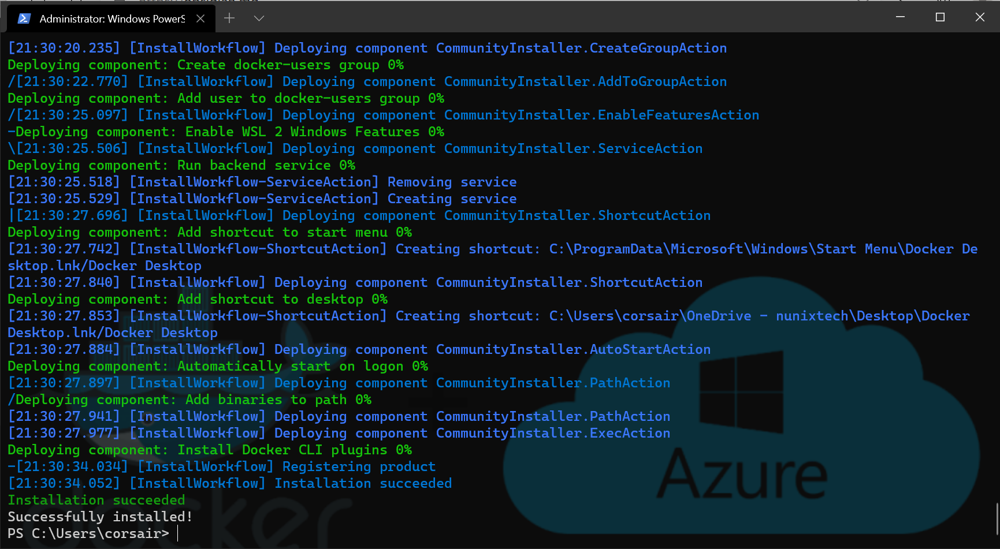

* Launch Docker Desktop from the Start menu


> **Attention:** The first time, it will request to logout in order to add our user to the Docker group


* Logout and login again, then launch Docker Desktop one more time

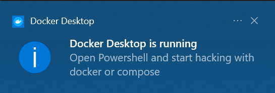

We should now see the Docker Desktop window, meaning we successfully installed Docker Destkop:

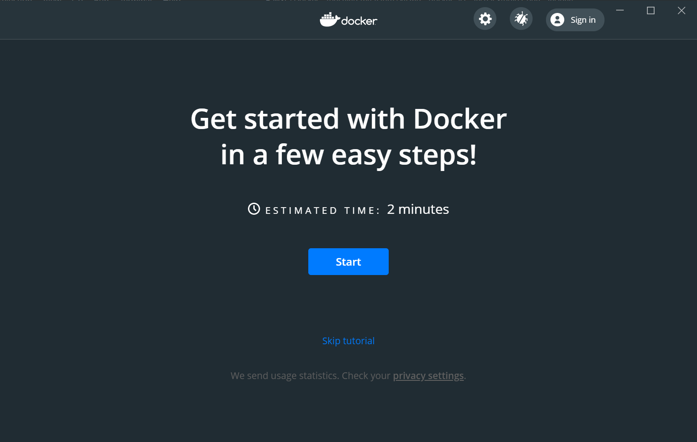

Open again, open a Terminal and try running the example given by Docker.

> *Note:* Docker Desktop creates the mounts and shares the binaries on the default WSL distro, that's why no setup is mentioned here

```bash
# Base command: docker run
# Parameters:
#   -d: run the container in "detached" mode
#   -p 80:80: binds the host port 80 to the container port 80
#   docker/getting-started: container image that will be used for creating the container
docker run -d -p 80:80 docker/getting-started
```

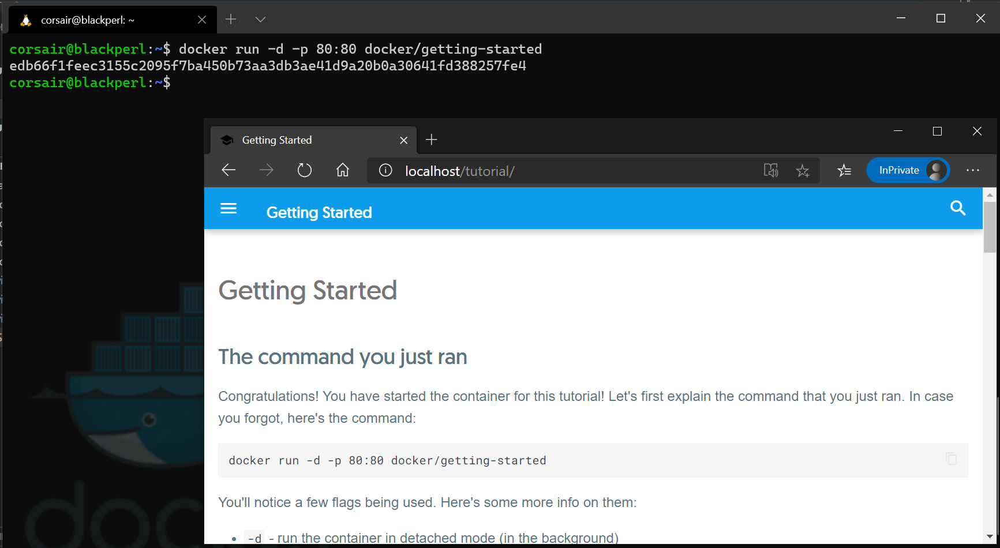

As we can see in the image above, thanks to WSL2 ports mapping, we can reach the container hosted website from a Windows browser. 

# Local or cloud: it depends on the context

For anyone who already worked with Docker, the step before is nothing new. We "simply" ran a container on our local computer.

So how do we move from our local computer to the Cloud? Well, meet a (not so much) new Docker concept: contexts.

For the ones reading this blog, we already [played with contexts](https://wsl.dev/wsl2dockerk8s/), but this one is a bit different, as now we have a "type".

Ok, enough talk, let's have a concrete look and create our Azure context:

* List the current context

```bash
# Base command: docker context
# Parameters:
#   ls: lists all the available contexts
docker context ls
```


> *Note:* As we can see in the image above, Docker Desktop Edge creates a link in WSL `.docker` directory for the contexts towards the `.docker` directory in our Windows user home directory.
> This small tweak is actually very intelligent as it allows Windows and WSL2 environments to share the same contexts.

* Login into Azure from Docker

```bash
# Base command: docker login
# Parameters:
#   azure: environment to login > this switches the login process from a docker registry (default: docker hub) to Azure
docker login azure
```


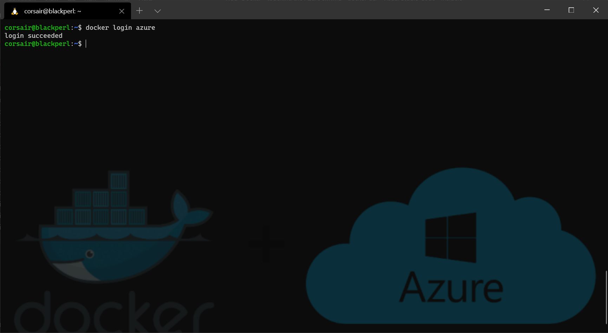

> **Attention:** On Linux, the package `xdg-utils` needs to be installed as the login process will launch a webpage page.
> So, if the package is not installed, we might have the following error:

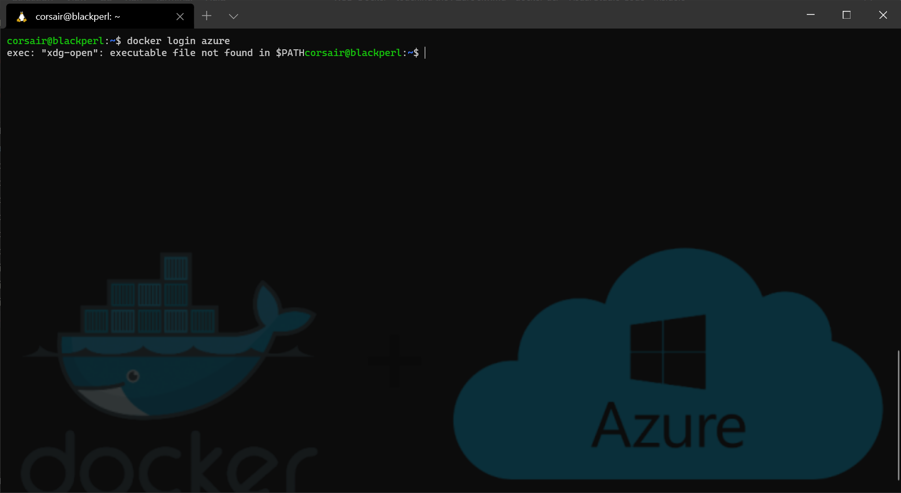

* Create a new Docker context for ACI

```bash
# Base command: docker context create
# Parameters: 
#   aci: type of context > new option for the context creation
#   azurecloud: name of the context > feel free to choose anything else
docker context create aci azurecloud
```

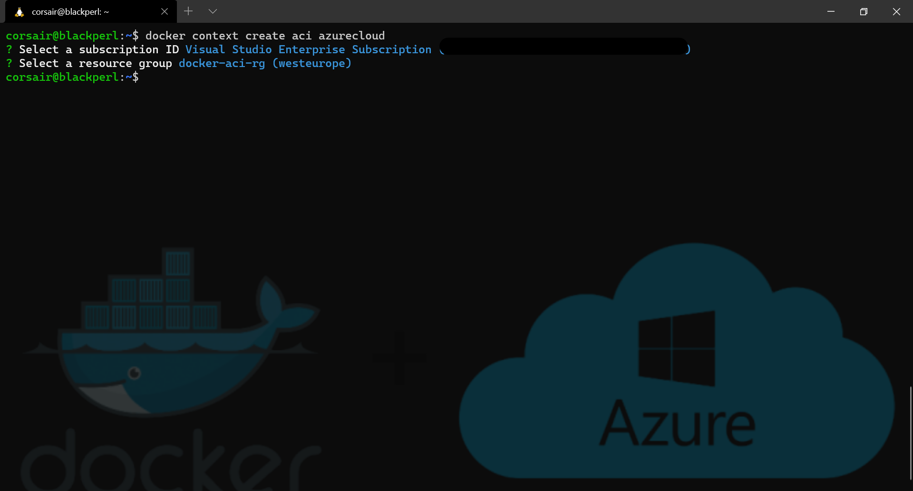

* List the contexts and switch to the newly created context

```bash
docker context ls

# Base command: docker context use
# Parameters:
#   azurecloud: name of the context created before
docker context use azurecloud

docker context ls
```


> *Note:* We can see which context is active by spotting the "*" near the name of the context or run the command `docker context show`, which will print **only** the name of the current selected context

Now that we have our new ACI context created, we can deploy containers into the cloud.

# The whale is swimming in the Azure cloud

With the context created, we will deploy *the exact same* container as we did locally and, even more beautiful, we will use the *exact same command*.

* Deploy the container into ACI

```bash
docker context ls

docker ps

docker run -d -p 80:80 docker/getting-started

docker ps
```


> **Attention:** to list the containers in the ACI context, `docker ps` must be used as `docker container ls` will output an error.

* Check in the Azure Portal if the container is also listed

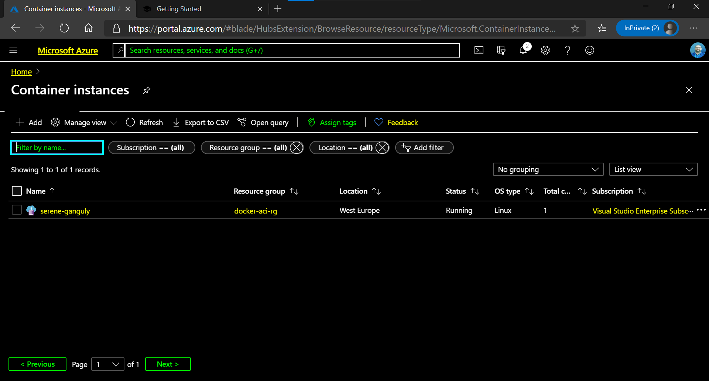

And done, how cool is this?! Using the same commands that we learnt while using `docker` locally, it allows us to publish containers into the Cloud.

Finally, in order to ensure we are not burning our Cloud credits (read: money), let's delete the container that we created.

* Delete the running container in ACI

```bash
docker ps

# Base command: docker rm
# Parameters:
#   serene-ganguly: name of the running container > this will be different for every container
docker rm serene-ganguly

docker ps
```


* And, as before, we can check in the Azure Portal if the container is no more listed

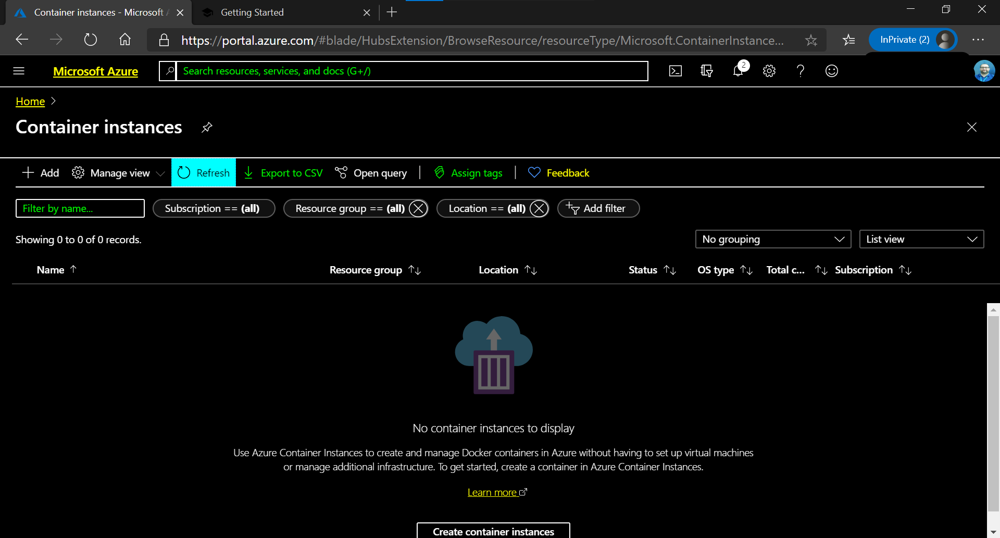

> *Note:* We need to click the "Refresh" button (highlighted in the image above) in order to see the correct and updated container list.

Congratulations! We have have successfully created and deleted a container in ACI. And I know it's repetition, but we did use the **exact same** commands as if we were working locally.

Now, let's have a quick look on the other tool that will help us a lot (read: another blog post will be necessary): `docker compose`.

# Compose: a Cloud maestro

Let's be real, nowadays the chance of having an application that runs only with one container is quite rare.
So in order to ensure the Docker users (and yes, not only Devs ;) would have an identical experience while deploying to the Cloud, the awesome `docker compose` has been updated.

For the "veterans", they might have noticed that the command written is `docker compose` and not the usual `docker-compose`. This is already one of the updates: `compose` will become a plugin (i.e. buildx and app) rather than an additional binary, and frankly what a welcomed change.

Anyway, let's move on into testing it, that's why we're all here right.

In order to follow the example below, an optional prerequisite is needed: clone the "[Awesome Compose](https://github.com/docker/awesome-compose)" GitHub repository.
And because we are targeting Azure, we will be deploying the ASP.NET and SQL Server application.

* Clone the repository and move into the aspnet-mssql directory

```bash
git clone https://github.com/docker/awesome-compose.git

cd awesome-compose/aspnet-mssql/

ls -l
```

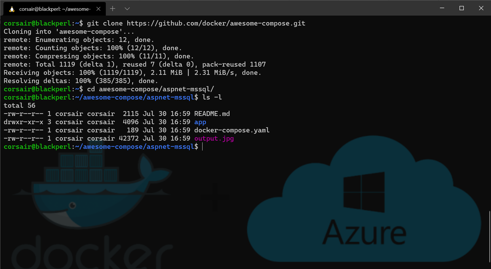

* Before we can launch the application, we need to change a value

```bash
# Visual Studio Code Insiders will be used in this example for editing the file
code-insiders docker-compose.yaml

# Replace the current MSSQL image by the newest image tag
      image: mcr.microsoft.com/mssql/server

# Save the file
```

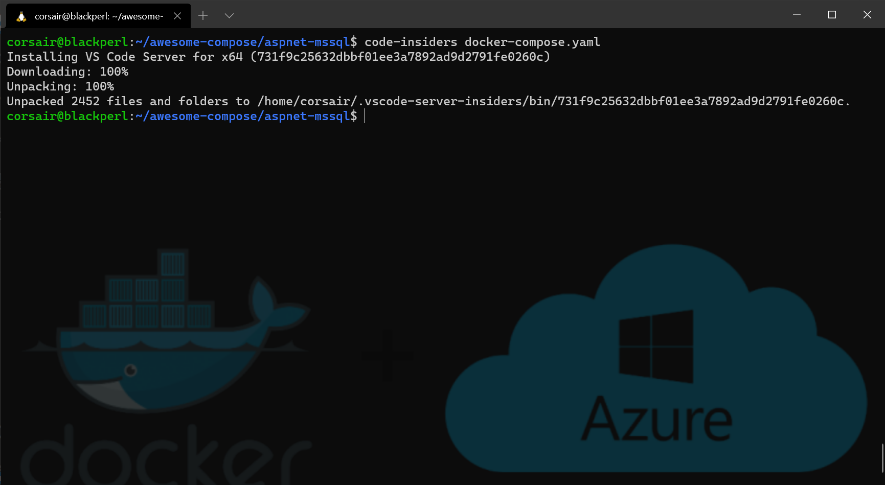

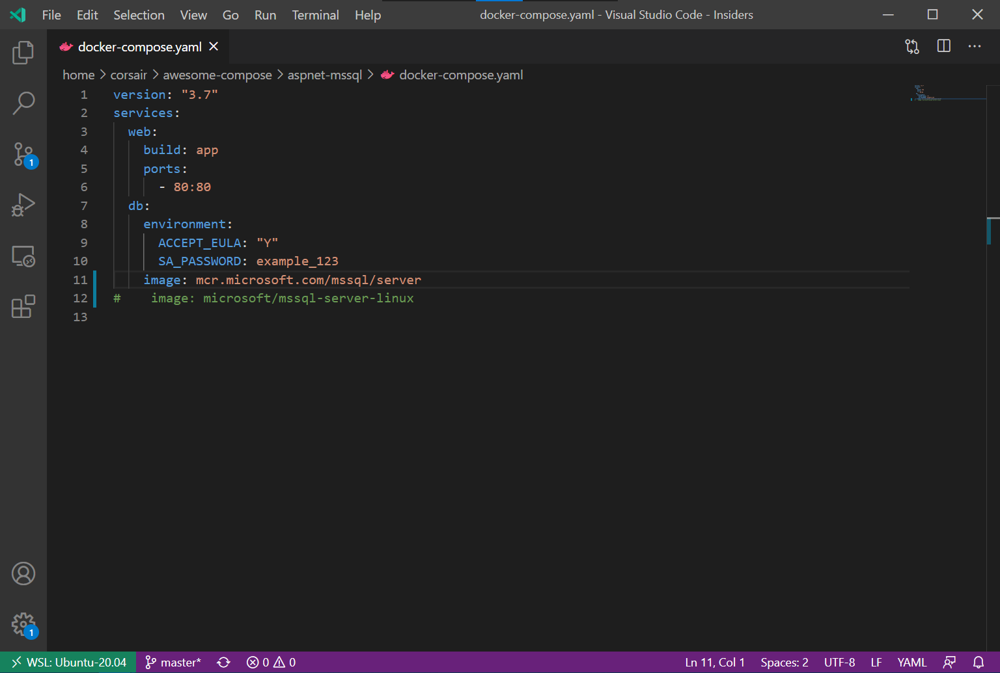

* First we will try it locally, so switch context and deploy the application

```bash
docker context use default

# Base command: docker-compose up
# Parameters:
#   -d: run the containers in "detached" mode
docker-compose up -d
```

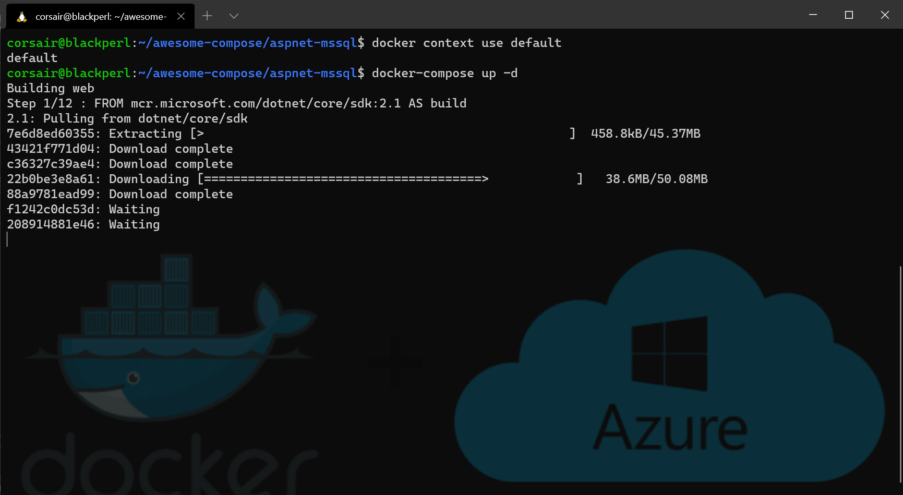

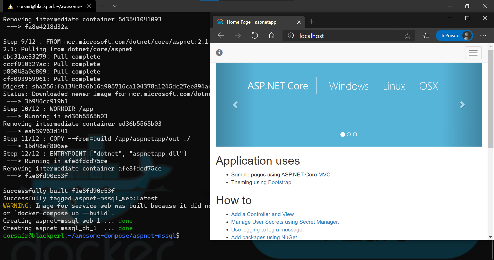

The application has been deployed and we could reach it with our Web browser.

The next step is to deploy it into the Cloud as we did with the single container. However, for the time being, we can only deploy applications that have images in a registry and cannot deploy an application that builds the image during the deployment.

* We will push the image that was built into Docker Hub

```bash
docker login

docker image ls

# Base command: docker tag
# Parameters:
#   aspnet-mssql_web: name of the image built locally
#   nunix/aspnet-mssql_web:latest: name of the repository followed by the name of the image and version
docker tag aspnet-mssql_web nunix/aspnet-mssql_web:latest

# Base command: docker push
# Parameters:
#   nunix/aspnet-mssql_web:latest: name of the repository followed by the name of the image and version
docker push nunix/aspnet-mssql_web:latest
```


* We can now copy the compose file in order to add the image we pushed

```bash
cp docker-compose.yaml docker-compose-aci.yaml

# Visual Studio Code Insiders will be used in this example for editing the file
code docker-compose-aci.yaml

# Replace the build parameter by the image name
    image: nunix/aspnet-mssql_web:latest
```

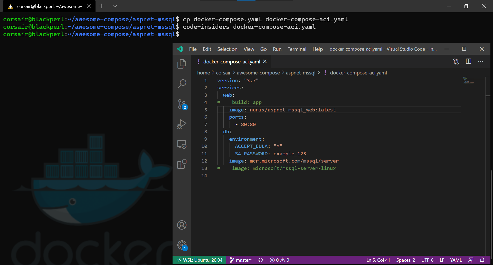

* Switch context to the ACI that we created before and deploy the application

```bash
docker context use azurecloud

# Base command: docker compose up
# Parameters:
#   -f docker-compose-aci.yaml: compose configuration file for ACI
#   -d: run the containers in "detached" mode
docker compose up -f docker-compose-aci.yaml -d 
```


> *Note:* In case of error with Azure due to timeout or because the terminal was closed, we should not hesitate to run `docker login azure` one more time.

* We can check how a compose deployment is seen in Azure

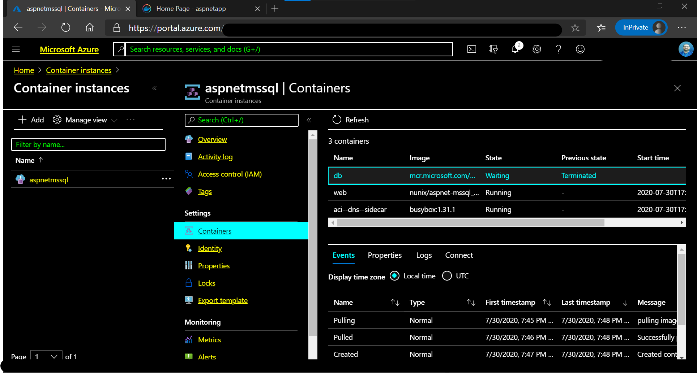

* Finally we can clean our deployment in order to avoid unnecessary costs

```bash
docker compose down -f docker-compose-aci.yaml
```

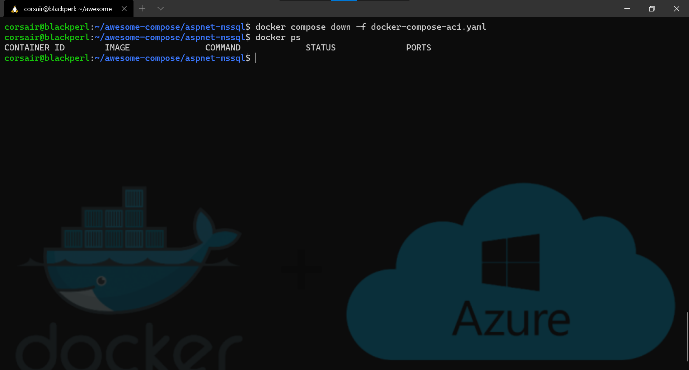


# Conclusion

When writing the blog posts, there is so much tests before getting the final solution that we lose track of the time.
Still, in this particular case, all the steps really worked fine and almost from the very first try. All, except for the `docker compose` part where the ACI integration showed some limitations.

Now, these limitations will either be covered in the future or alternatives will be found by the community and that's what I'm personally looking for the most.

I really hope this blog will be helpful and not only a "simple ripoff" of Ben's blog and as always, if anyone have a comment or question, I can be found on Twitter [@nunixtech](https://twitter.com/nunixtech)

> \>>> Nunix out <<<

---

# Bonus 1: What is a Cloud without Volume
Now that we could run single container and a Compose application in the Cloud, let's make it even more fun by adding a volume. Once again, we will try it with a single container first.

Before we deploy the container, we will need to create an Azure File share as explained in this excellent [Azure blog post](https://docs.microsoft.com/en-us/azure/container-instances/container-instances-volume-azure-files).
This is needed as, for now at least, we cannot create a volume in Azure with Docker cli.

Ok, enough talk, let's continue the fun.

## Azure CLI: knocking on Azure's door
There is multiple ways to create an Azure File share, and as we are already in the "console realm", let's stay there and use the powerfull `az` command:

- Install the `az` command in WSL as described [here](curl -sL https://aka.ms/InstallAzureCLIDeb | sudo bash)

```bash
curl -sL https://aka.ms/InstallAzureCLIDeb | sudo bash
```

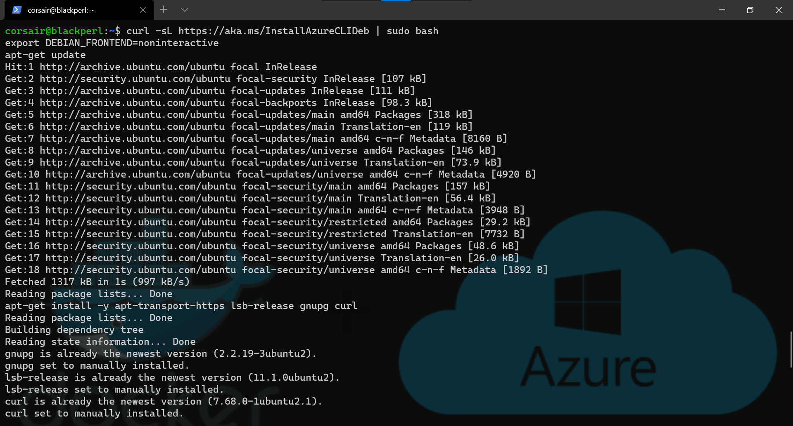

- Login with `az` to our Azure account

```bash
az login
```

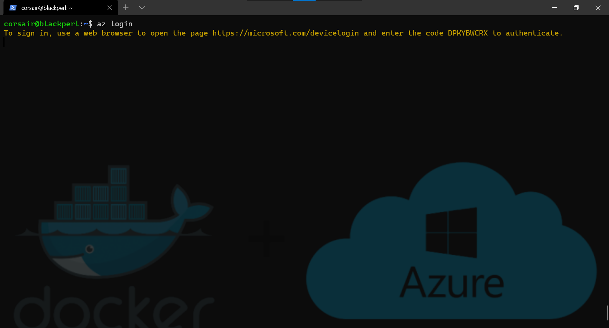

- List the resource groups created

```bash
az group list
```

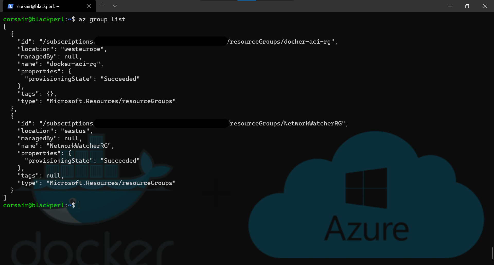

> *Note:* if we want to find only a single value that contains the word "Docker" in the name, we can use the `--query` option
> *Example:* `az group list --query "[?contains(name, 'docker')]"`


## Azure File share: what a stateful place to be
Now that we knowthe exact name of the resource group created by Docker, we can reuse it in order to keep everything "clean" and create our Azure File share in it.

As defined in the [blog post](https://docs.microsoft.com/en-us/azure/container-instances/container-instances-volume-azure-files), we will first define the variables, easier for reusability, and then create the Azure File share, which is part of the Azure Storage account.

- Define the variables

```bash
export ACI_PERS_RESOURCE_GROUP=docker-aci-rg
export ACI_PERS_STORAGE_ACCOUNT_NAME=dockerstorage$RANDOM
export ACI_PERS_LOCATION=westeurope
export ACI_PERS_SHARE_NAME=dockershare
```


**Attention:** The Azure Storage Account Name needs to be globally unique, so a `random` value is added to the end

- Create the Azure Storage account

```bash
az storage account create \
    --resource-group $ACI_PERS_RESOURCE_GROUP \
    --name $ACI_PERS_STORAGE_ACCOUNT_NAME \
    --location $ACI_PERS_LOCATION \
    --sku Standard_LRS
```

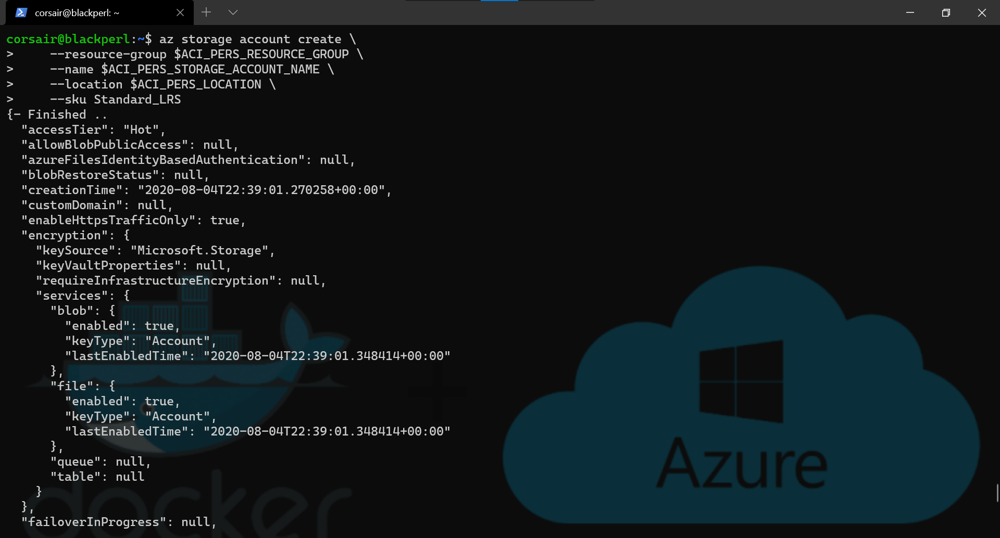

- Create the Azure File share

```bash
az storage share create \
  --name $ACI_PERS_SHARE_NAME \
  --account-name $ACI_PERS_STORAGE_ACCOUNT_NAME
```


- Get the Azure Storage account key

```bash
export ACI_PERS_STORAGE_ACCOUNT_KEY=$(az storage account keys list --resource-group $ACI_PERS_RESOURCE_GROUP --account-name $ACI_PERS_STORAGE_ACCOUNT_NAME --query "[0].value" --output tsv)

echo $ACI_PERS_STORAGE_ACCOUNT_KEY
```

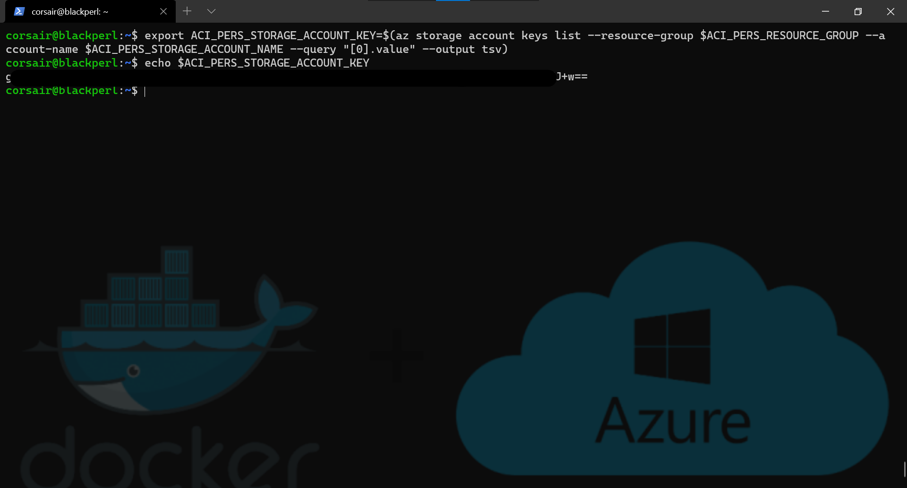

## Volume: once local, now global
We have now all the values needed for using a volume with our Docker containers.

This is great, however mapping volumes will be slightly different from the ones we normally have locally.
And the best way to find what difference it could be, let's see what the help says:

```bash
# Ensure the context is the ACI one
docker context use azurecloud

docker run --help
```


As we can see in the picture above, the `--volume` option needs the following value for the "local" mount: `user:key@my_share`.

The rest of the command is the same as we know, so let's run a container with the image used in the [blog post](https://docs.microsoft.com/en-us/azure/container-instances/container-instances-volume-azure-files).

- List the content in the Azure File share

```bash
az storage file list --share-name $ACI_PERS_SHARE_NAME --account-name $ACI_PERS_STORAGE_ACCOUNT_NAME --account-key $ACI_PERS_STORAGE_ACCOUNT_KEY
```


- Create the container

```bash
docker run -d --name dockeracivol -p 80:80 -v $ACI_PERS_STORAGE_ACCOUNT_NAME:$ACI_PERS_STORAGE_ACCOUNT_KEY@$ACI_PERS_SHARE_NAME:/aci/logs mcr.microsoft.com/azuredocs/aci-hellofiles

docker ps

# Open a browser to the IP address from the container
```

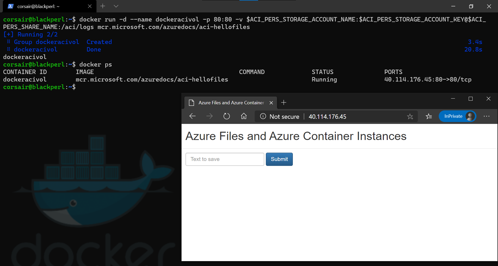

- Create a file from the container application

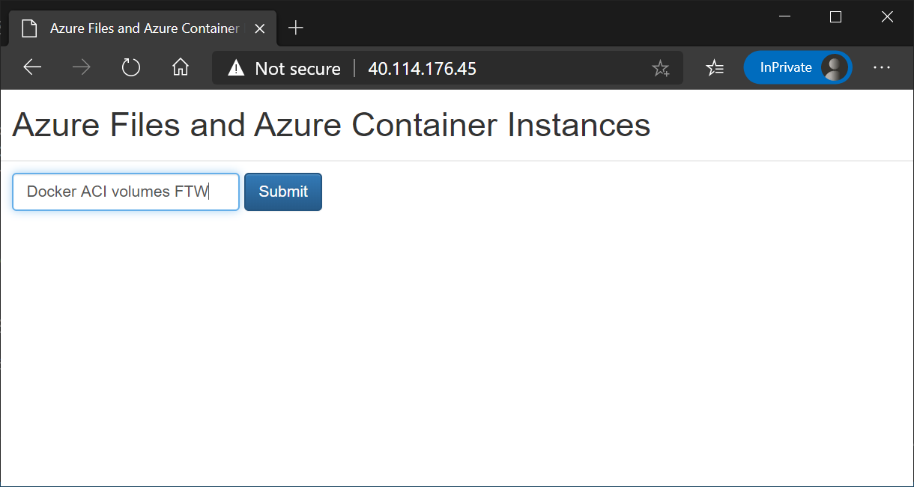

- List the files in the Azure File share to confirm the creation of the file

```bash
az storage file list --share-name $ACI_PERS_SHARE_NAME --account-name $ACI_PERS_STORAGE_ACCOUNT_NAME --account-key $ACI_PERS_STORAGE_ACCOUNT_KEY
```

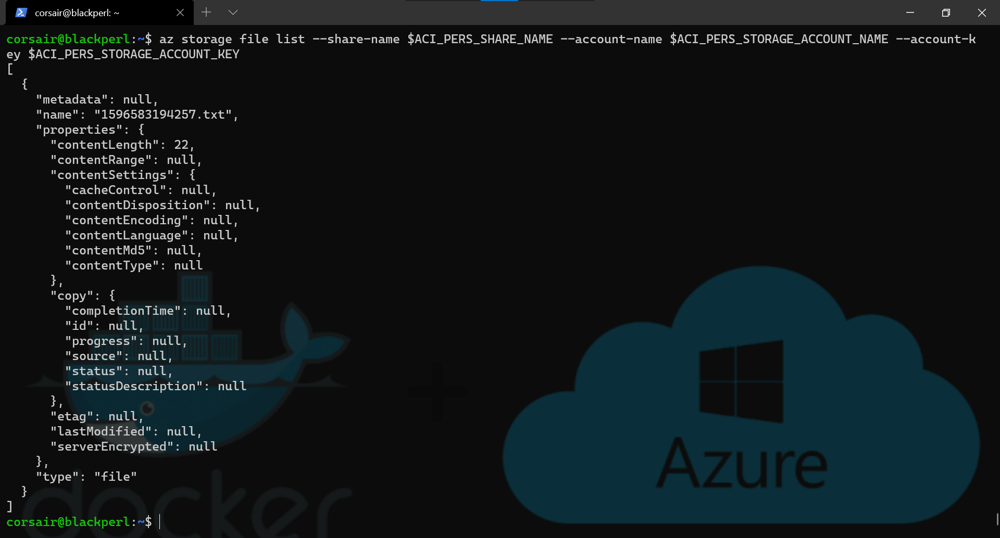

- Get the name of the file and store it into a variable

```bash
export azfilename=$(az storage file list --share-name $ACI_PERS_SHARE_NAME --account-name $ACI_PERS_STORAGE_ACCOUNT_NAME --account-key $ACI_PERS_STORAGE_ACCOUNT_KEY --query "[].name" -o tsv)

echo $azfilename
```


- Download the file

```bash
az storage file download --share-name $ACI_PERS_SHARE_NAME --path "$azfilename" --dest "$PWD/$azfilename" --account-name $ACI_PERS_STORAGE_ACCOUNT_NAME --account-key $ACI_PERS_STORAGE_ACCOUNT_KEY
```


- Check the content of the file

```bash
ls $PWD/$azfilename

cat $PWD/$azfilename
```

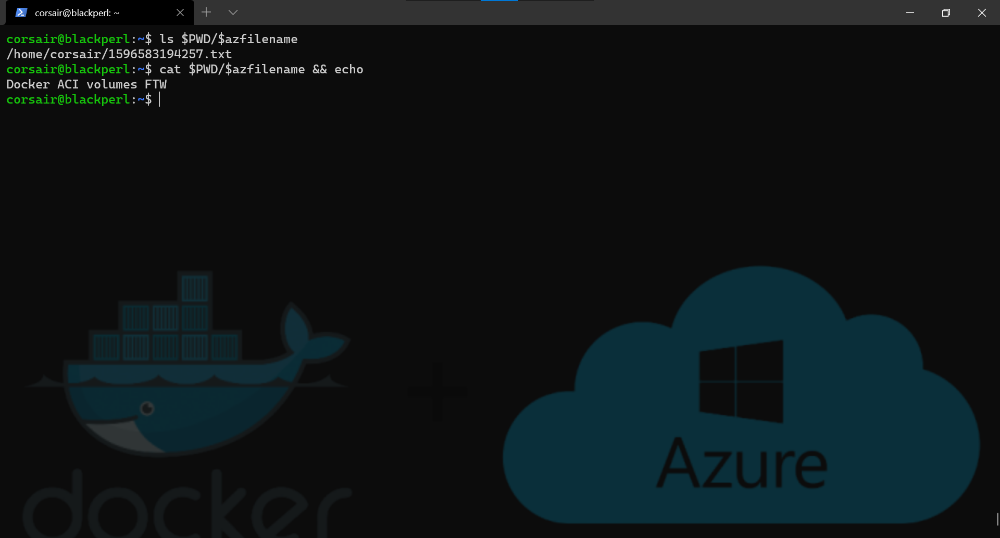

- Finally, remove the container

```bash
docker ps

docker rm dockeracivol

docker ps
```


## Bonus 1: Conclusion
While it requested additional preparation, deploying a container with an Azure File share as a volume is still made very simple by Docker.

This part also showed that our Azure knowledge can be leveraged and, once again, anything in the Cloud could be managed from our Terminal in our computer. Welcome to the Cloud CLI golden age.