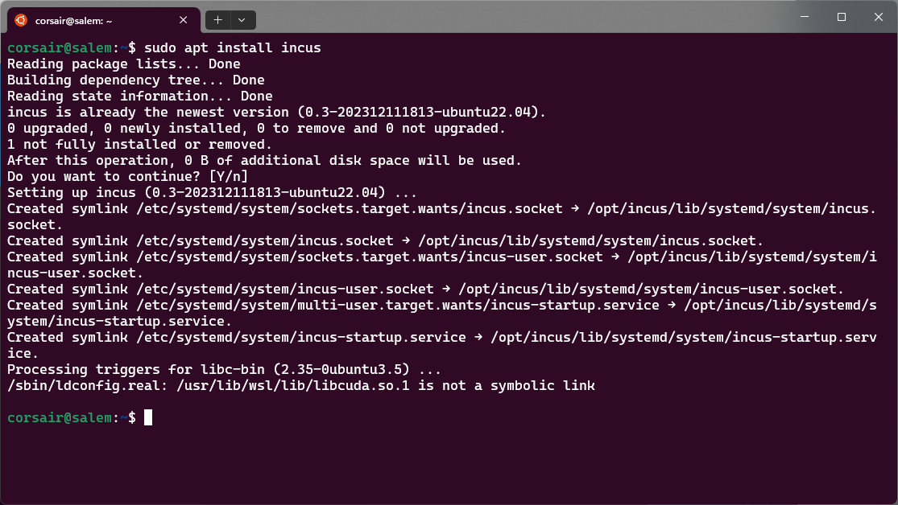
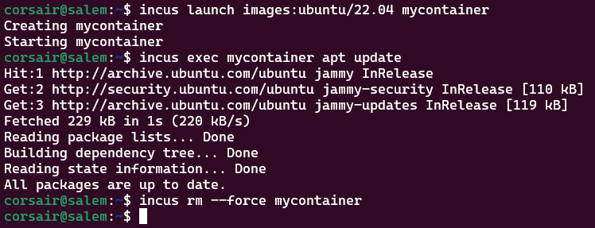
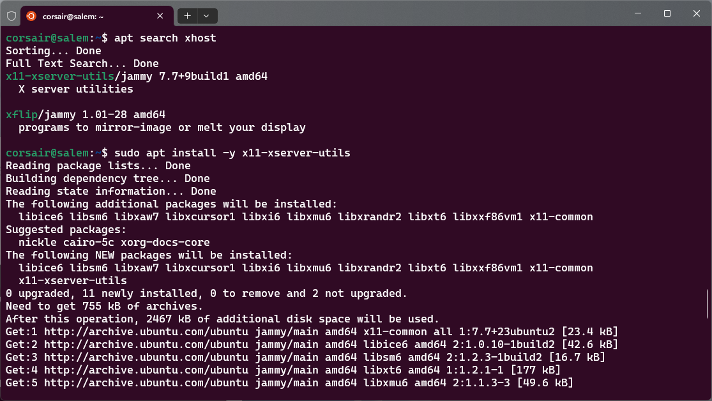
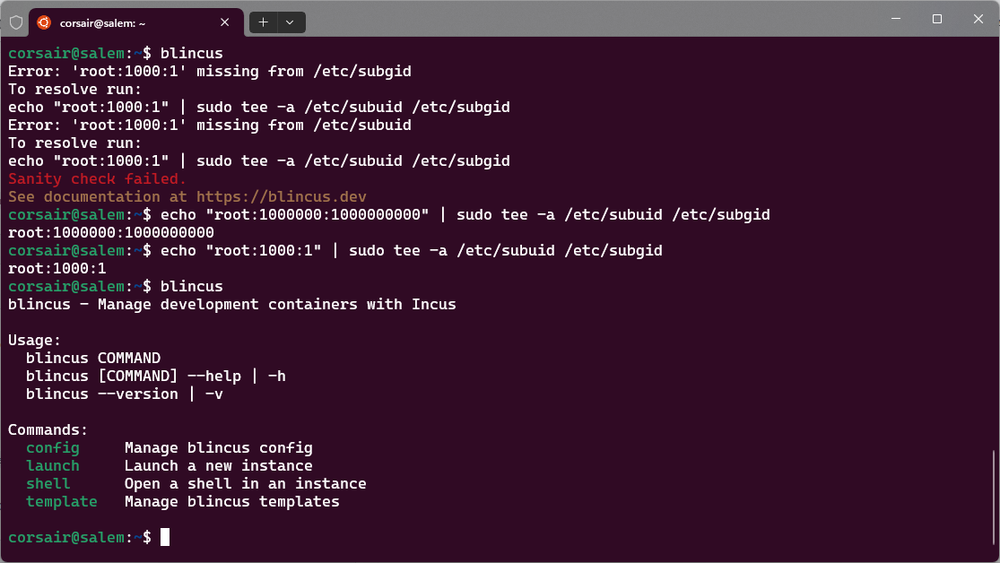
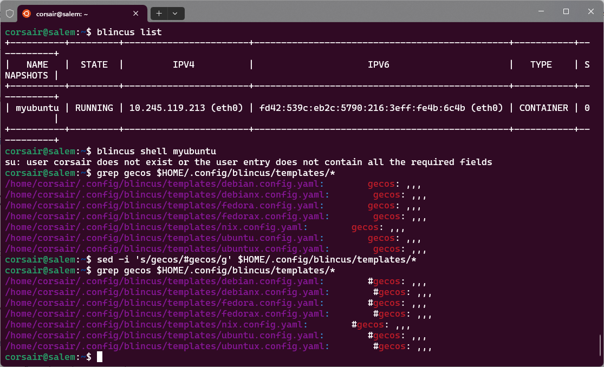

# Introduction

2023 went by fast, very fast. And while there was no new blog posts in this site, I found out many persons that use this blog to solve potential issues on their daily work.

This means the world to me and therefore I can already tell you that 2024 will have at least 1 blog per month!

And I can already tell you that the January one will be a first: a reader sent me some details about a test and asked if I could blog about after testing it. It's network related and about a real world use case, so stay tuned!

With all that said, let's focus on the topic we're all here for, the latest great project from my friend and the Owner of wsl.dev: [Brian Ketelsen](https://twitter.com/bketelsen). Let me introduce [Blincus](https://blincus.dev/).

# Prerequisites

Here's the list of components I used for this blog post:

* OS: Windows 11 Professional version 23H2 - channel: General Availability / build: 22631

* WSL version: 2.0.14.0 (pre-release)

* WSL kernel: 5.15.133

* WSL2 distro: [Ubuntu 22.04](https://apps.microsoft.com/store/detail/ubuntu/9PDXGNCFSCZV)

  * Debian can also be a choice here.

  * Since [WSL v0.67.6](https://github.com/microsoft/WSL/releases/tag/0.67.6), systemD can be enabled in `/etc/wsl.conf`

  * The distro hostname is set in `/etc/wsl.conf`

  * `cgroup2` is activated in `$env:USERPROFILE\.wslconfig`

    * ```shell
      [wsl2]
      kernelCommandLine = cgroup_no_v1=all systemd.unified_cgroup_hierarchy=1
      ```

* [Optional] Terminal: [Windows Terminal](https://www.microsoft.com/en-us/p/windows-terminal/9n0dx20hk701)

  * Version: 1.18.3181.0

# Spell 1: Incus

Like every wizard, before you cast the biggest and coolest spell (i.e. Patronus), you need to know your basic spells.

In this case, the first spell to learn is [Incus](https://linuxcontainers.org/incus/), a fork of [LXD](https://github.com/canonical/lxd). If you want to know more about this fork and why it exists, you can read the [initial announcement](https://linuxcontainers.org/incus/announcement/) from the maintainers.

## Installation

The first task will be to install Incus on the WSL distro.

While Incus can be installed from source, the most comfortable way will be to use the available Debian or Ubuntu packages provided by [Zabbly](https://zabbly.com/).

The full installation steps are described at https://github.com/zabbly/incus and it's strongly recommended you follow them.

Here's the short version without much details. Again, go read the initial steps, and while there give it a star:

```bash
# Add repo key
sudo mkdir -p /etc/apt/keyrings/
sudo curl -fsSL https://pkgs.zabbly.com/key.asc -o /etc/apt/keyrings/zabbly.asc

# Add repo data
sudo sh -c 'cat <<EOF > /etc/apt/sources.list.d/zabbly-incus-stable.sources
Enabled: yes
Types: deb
URIs: https://pkgs.zabbly.com/incus/stable
Suites: $(. /etc/os-release && echo ${VERSION_CODENAME})
Components: main
Architectures: $(dpkg --print-architecture)
Signed-By: /etc/apt/keyrings/zabbly.asc

EOF'

# Refresh the repo list and install Incus
sudo apt update
sudo apt install incus
```

> NOTE: if you end up with the error `E: Sub-process /usr/bin/dpkg returned an error code (1)` this might mean systemd is not enabled. Enable it in `/etc/wsl.conf`, stop the instance with `wsl --terminate` from powershell and run again the install command `sudo apt install incus`
>
> 


## Configuration

Once the installation completed, before you can use Incus, you'll need to perform some configuration.

Once again, it's strongly recommended you read the [original docs](https://linuxcontainers.org/incus/docs/main/tutorial/first_steps/#install-and-initialize-incus) to understand the reason behind the following steps:

```bash
# Add your user to the incus-admin group
sudo adduser $USER incus-admin

# Exit your session and start a new one

# Initialize Incus
incus admin init --minimal

# Check the Incus version, the server and client should be the same
incus version
```


## First instance

With the configuration done, you can now run your first instance:

```bash
# Launch a container
incus launch images:ubuntu/22.04 mycontainer

# Do a quick test. Example: update the repos, this will show if you have network
incus exec mycontainer apt update

# [Optional] Delete the container once no more needed
incus rm --force mycontainer
```



## Spell acquired

Congrats, you just learnt the first spell! If you need or want to discover a bit more about Incus, now it's a good time. Try to have a look on the container created, see what user is logged in, do you see any host data/moutpoints?

Getting a feeling of what you have and the potential limitations for your workflow is exactly what will make you appreciate even more the next spell: Blincus!

# Spell 2: Blincus

If you reached this part, then congrats on learning the first spell, as this second spell is a continuation of the first one and makes it even more powerful.

This second spell has been created by one of the best wizards alive: [Monsieur Brian](https://twitter.com/bketelsen).

Like the first spell, you are strongly encouraged to go check the [original grimoire](https://blincus.dev/) to learn how to master this spell, as you'll find only a glimpse in this page.

Ready?

## Installation

Blincus can be installed in different ways and with a set of options that you can use depending on your needs. You can find all the needed documentation in [the installation page](https://blincus.dev/guides/installing/).

Here, you'll install the latest release in the standard way, without any options:

```bash
# Install Blincus
curl -s https://raw.githubusercontent.com/ublue-os/blincus/main/install | sh
```


And to avoid you the "surprise" to find later something is missing, the WSL Ubuntu distro misses a package for launching Blincus graphical instances:

```bash
# Search the package containing `xhost`
apt search xhost

# Install the package containing `xhost`
sudo apt install -y x11-xserver-utils
```



## Configuration

Before you can use Blincus, you'll need to apply the following configuration:

```bash
# [Optional] As shown in the install output, add $HOME/.local/bin to your PATH
printf '\n# Blincus\nexport PATH=$PATH:$HOME/.local/bin\n' >> .bashrc

## Check if it has been added correctly
tail $HOME/.bashrc

## Reload the .bashrc file
source .bashrc
```


Once Blincus is on your ` PATH`  variable, you can try to run it and you'll be welcomed with an error message!

The output is self-explanatory, however it only reflects half of what needs to be done. To have the full picture, you can see the [post-install documentation](https://blincus.dev/guides/post-incus-install/#post-install):

```bash
# Run Blincus without any argument
blincus

# Add the ID mappings
echo "root:1000000:1000000000" | sudo tee -a /etc/subuid /etc/subgid
echo "root:1000:1" | sudo tee -a /etc/subuid /etc/subgid

# Run Blincus without any argument
blincus
```



## First instance

With all the configuration done, you can now start your first Blincus instance:

```bash
# List the Blincus templates
blincus template list

# Launch the first instance. In this example, Ubuntu with X sharing is selected
blincus launch --template ubuntux myubuntu
```


At the end of the instance creation, you can see the command to enter your newly created instance. However, on WSL, this will end with an error stating your user doesn't exist inside the instance.

This is due to a field inside the `cloud init` template file not being interpreted correctly. Luckily for you, here's the solution:

```bash
# List the Blincus instances
blincus list

# Try to shell in to your created instance
## This will generate an error
blincus shell myubuntu

# Check for the 'gecos' field inside the cloud init template files
grep gecos $HOME/.config/blincus/templates/*

# Comment the gecos line in the cloud init template files
sed -i 's/gecos/#gecos/g' $HOME/.config/blincus/templates/*

# Check if the 'gecos' field is correctly commented
grep gecos $HOME/.config/blincus/templates/*
```



With the cloud init template files "patched", you can create a new instance:

```bash
# Delete the previous instance
blincus rm --force myubuntu

# Check if the instance has been correctly deleted
blincus list

# Launch a new instance with the same template
## You should see that the cloud init stage takes more time
blincus launch --template ubuntux myubuntu

# Shell in to your created instance
blincus shell myubuntu
```

## [Optional] See the power

If you followed along and picked a graphical template, such as `ubuntux`, then you can launch a graphical app and it will be displayed by WSLg:

```bash
# Install a graphical app. In this example, the package containing xeyes is selected
sudo apt install -y x11-apps

# Launch a graphical app. In this example, xeyes
xeyes
```


## [Optional] Hear the power

And if you want to really impress your friends, sound is also enabled via pulseaudio and you can play with something fun:

```bash
# Install a text-to-speach app. In this example, espeak is selected
sudo apt install espeak

# Test the sound
espeak "Brian Ketelsen and the whole Incus team are the real stars of this show"
```

# Conclusion

As stated in the introduction, this is really just a glimpse of what both Incus and Blincus can do!

On the backend side, Incus can do so much more than just create containers and you should really check the capabilities as it might help you in several occasions.

On the frontend side, Blincus provides a series of templates and more importantly, a customization that makes you feel like home. Yes, it's very opiniated, and if you know cloud-init, or learn it by copying one existing template, then you can "make it yours" even more.

Hope you enjoyed this short wizardry and if you reached this far, then I thank you very much and wish you a Merry Christmas and Happy New Year!

See you in 2024.

> \>\>\> Nunix out \<\<\<
