# Introduction

Do you want to install Docker on a brand new WSL2 19.10 distro? Make it available on "boot" via SystemD?

Now it's possible and for the first time, it will be explained as a "fast track". A new series of mini-blogs with (very) few chat and lots of hands-on.

# Prerequisites

As "usual", the prerequisites will be:

1. [Windows 10 insider fast (current: 19008)](https://insider.windows.com/en-us/)
2. [WSL2 feature installed](https://docs.microsoft.com/en-us/windows/wsl/wsl2-install)
3. [Ubuntu 19.10 WSL rootfs](https://wiki.ubuntu.com/WSL)

# Ermine has a new home

The first step will be to create a new WSL distro.

In this example, the server version will be the one chosen:

```
PS> mkdir c:\mywsldistros
PS> wget https://cloud-images.ubuntu.com/eoan/current/eoan-server-cloudimg-arm64-wsl.rootfs.tar.gz -OutFile ermine-server.tar.gz
PS> wsl.exe --import ermine c:\mywsldistros\ermine c:\mywsldistros\ermine-server.tar.gz --version 2
PS> wsl.exe -d ermine
# cat /etc/os-release
```

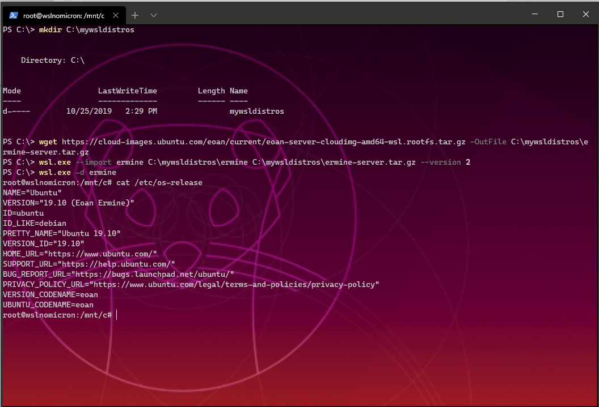

## System configuration

Let's configure the system by adding our user and [systemD](https://forum.snapcraft.io/t/snapd-on-wsl2-insiders-only-for-now/13033):

```
# apt update && apt upgrade -y
# useradd -m -s /bin/bash ermine
# apt install -yqq daemonize dbus-user-session fontconfig sudo vim
# vi /usr/sbin/start-systemd-namespace
# vi /usr/sbin/enter-systemd-namespace
# chmod +x /usr/sbin/enter-systemd-namespace
# vi /etc/bash.bashrc
# visudo
# vi /etc/wsl.conf
# exit
PS> wsl.exe --terminate ermine
PS> wsl.exe -d ermine
$> ps -ef
```

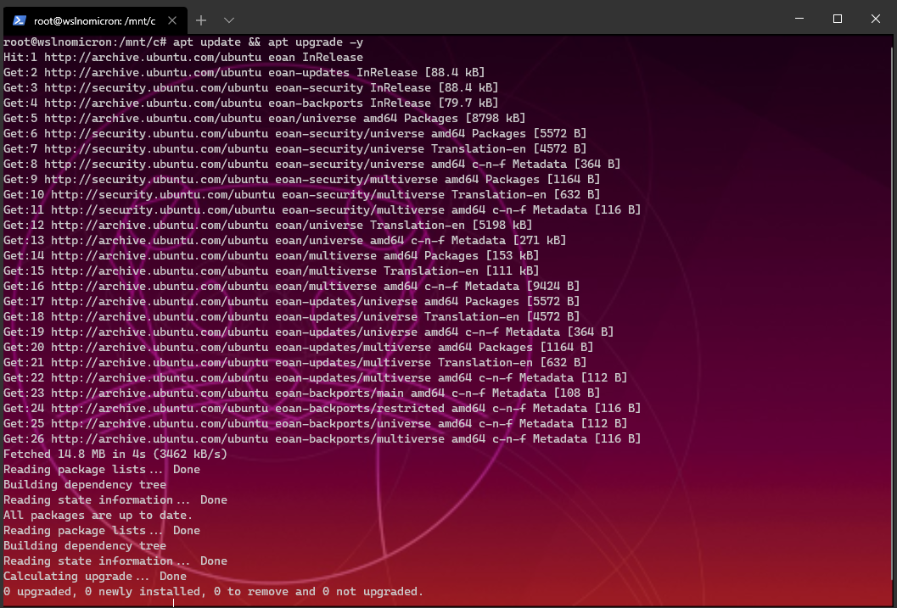

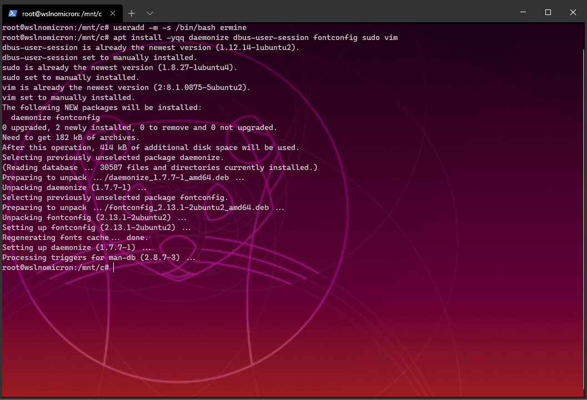

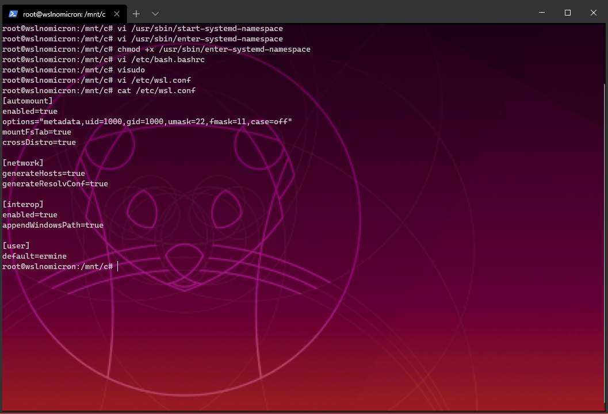

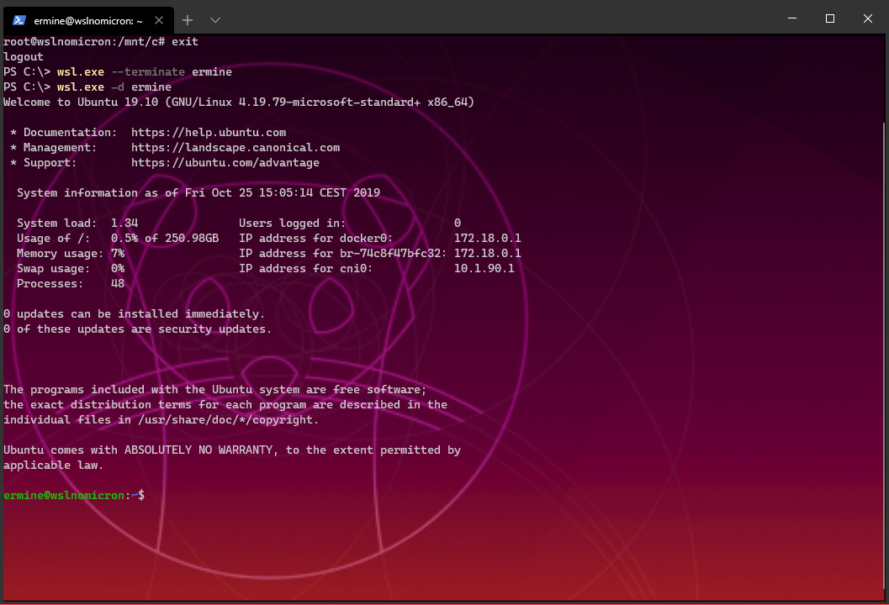

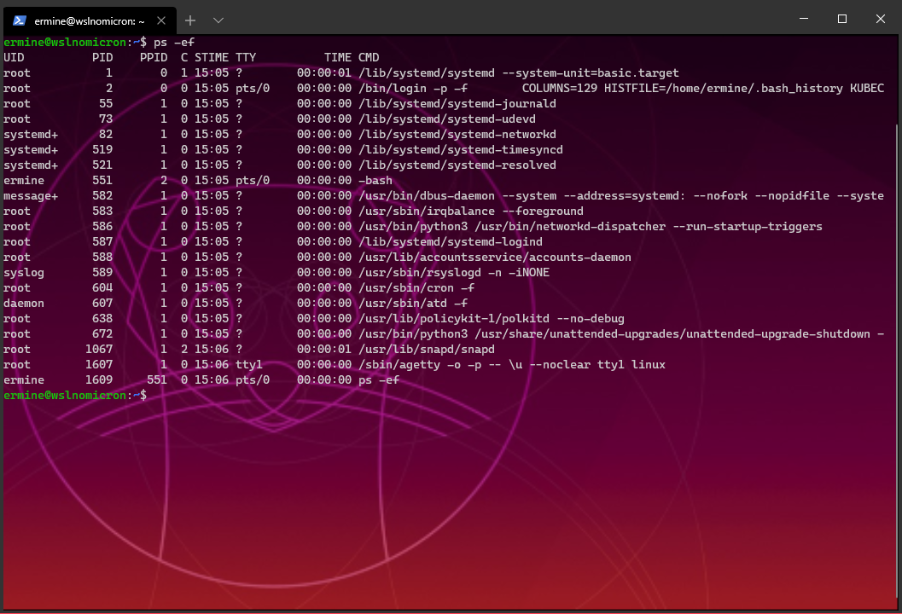

# The Whale is visiting

As the Docker package [does not exist](https://docs.docker.com/install/linux/docker-ce/ubuntu/#os-requirements) yet for Ubuntu 19.10 (mind the blog release date), the steps below are the "manual" approach:

```
$> wget https://download.docker.com/linux/static/stable/x86_64/docker-19.03.4.tgz
$> wget https://github.com/containerd/containerd/releases/download/v1.3.0/containerd-1.3.0.linux-amd64.tar.gz
$ sudo tar -xzf docker-19.03.4.tgz -C /usr/bin --strip-components=1
$ sudo tar -xzf containerd-1.3.0.linux-amd64.tar.gz -C /usr/bin --strip-components=1
$ sudo wget https://raw.githubusercontent.com/moby/moby/master/contrib/init/systemd/docker.service -O /etc/systemd/system/docker.service
$ sudo wget https://raw.githubusercontent.com/moby/moby/master/contrib/init/systemd/docker.socket -O /etc/systemd/system/docker.socket
$ sudo groupadd docker
$ sudo usermod -aG docker ermine
$ sudo systemctl enable docker.socket
$ sudo systemctl enable docker.service
$ sudo systemctl start docker.socket
$ sudo systemctl start docker.service
$ exit
PS> wsl.exe --terminate ermine
PS> wsl.exe -d ermine
$ docker version
```

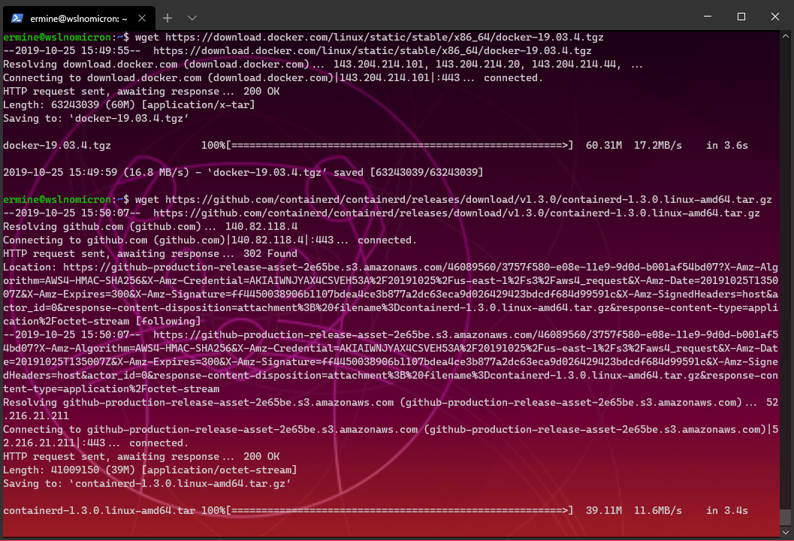

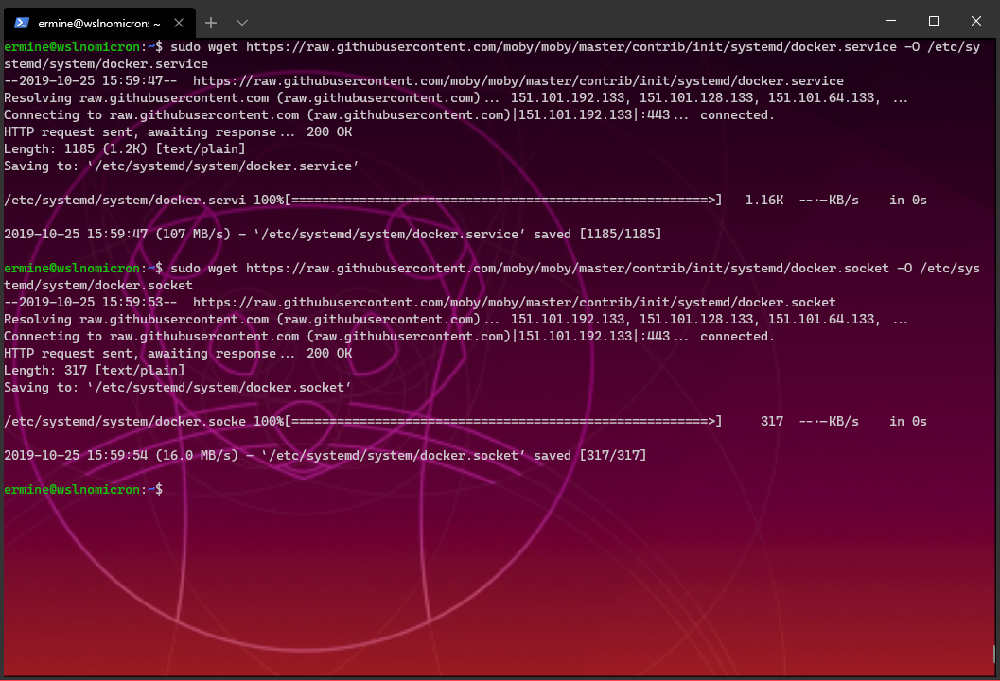

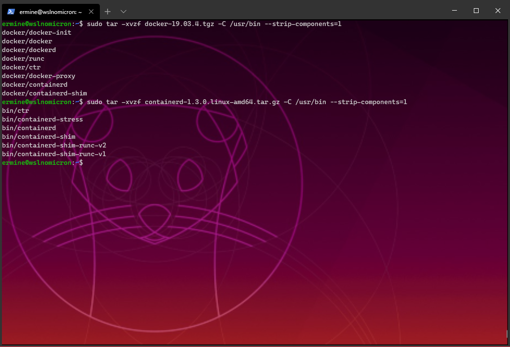

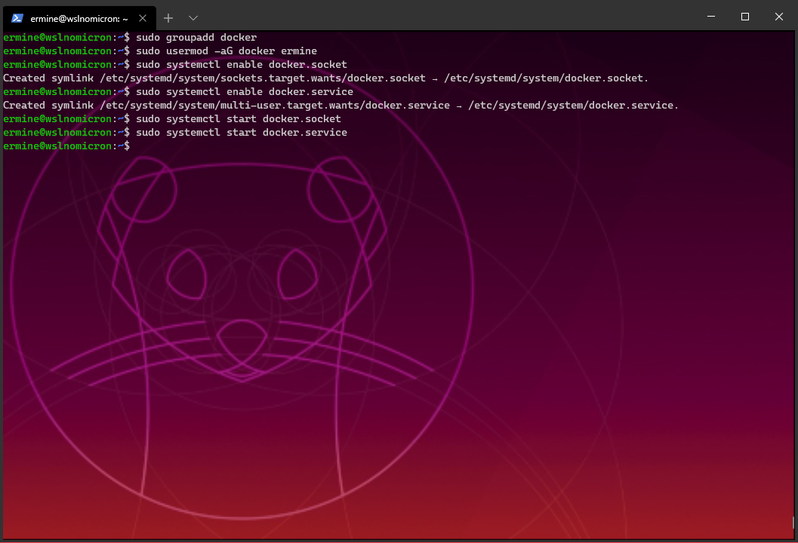

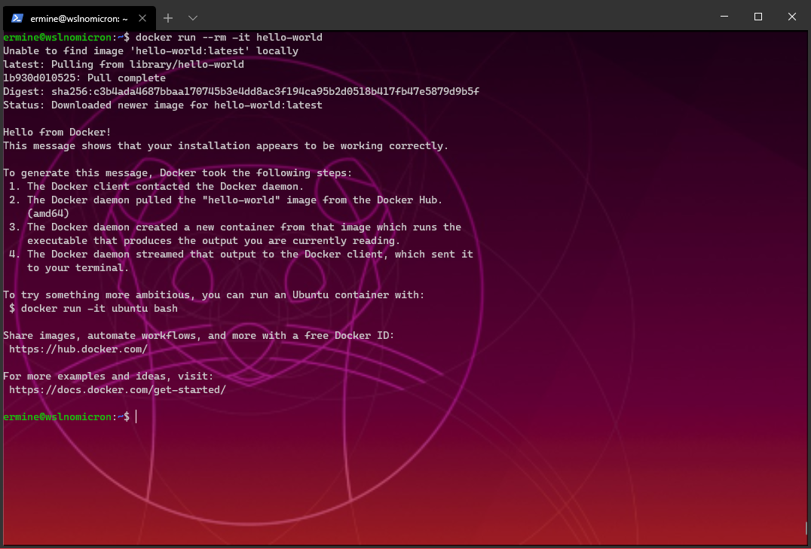

# Conclusion

Ok I promised right, no chat -> pure hands-on.

Still, the (huge) learning from this blog post is that Docker really helps getting things started fast. I mean, in a normal case, a simple package install would suffice and everything would have been good to go.

I hope this shorter format will please you, as I might do some more between two bigger blog posts. This will help me adding a bit more context to the "discovery tweets" I do regularly.

> _**\>>> Nunix out <<<**_

# Bonus 1: a Snap and Microk8s appears

Now that Docker is up and running, nowadays next step would be to add a Kubernetes context.

In this first bonus, we will add MicroK8s. To make it easy, let's follow the official [guide](https://microk8s.io/docs/):

```
$ sudo snap install microk8s --classic
$ microk8s.status --wait-ready
$ sudo snap alias microk8s.kubectl mk
$ mk cluster-info
$ mk get nodes
$ mk get services
```


## But wait! There's more

The goal is always to have a complete and integrated environment. To achieve that, some additional steps need to be performed.

As described in the guide, couple addons should be installed

```
$ microk8s.enable dns dashboard
$ mk cluster-info
```

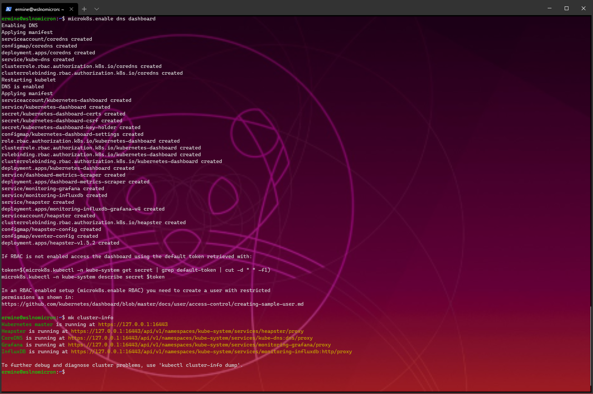

Finally, let's had our cluster as the Docker context endpoint:

```
$ docker context ls
$ mk config view --raw > $HOME/.kube/config
$ docker context ls
```

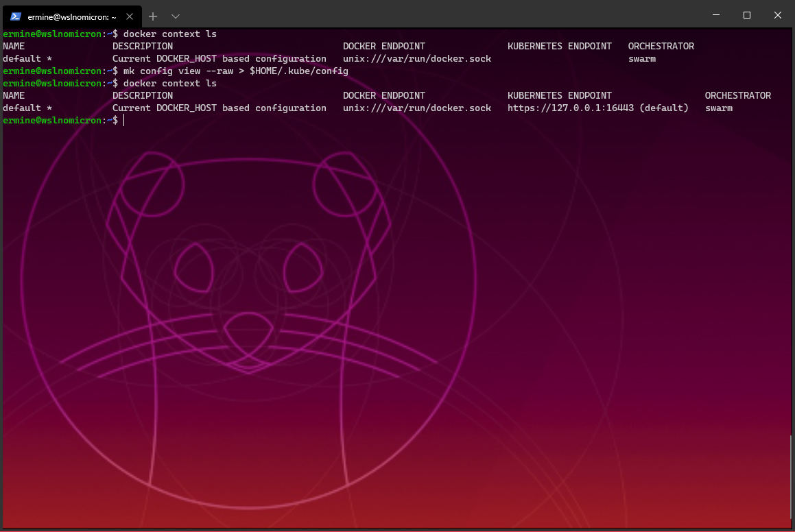
